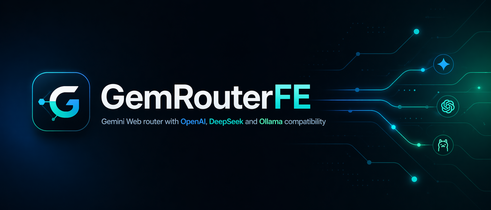

# GemRouterFE

<p align="center">
  
</p>

<p align="center">
  <strong>OpenAI-compatible local Gemini router with Gemini CLI primary execution and Playwright Gemini Web fallback.</strong>
</p>

<p align="center">
  
  
  
  
  
  
  
  
  
</p>

## Overview

`GemRouterFE` exposes provider-style HTTP APIs that existing clients already know how to call, while routing inference through:

1. Gemini CLI with cached Google login auth
2. Playwright-managed Gemini Web fallback with the existing authenticated browser profile

This repository is the product workspace for:

- the compatibility router
- the Gemini CLI primary runtime
- the browser-backed Gemini fallback runtime
- app and API-key policy management
- the operator dashboard
- recovery access through noVNC

It is not the paid Gemini API path and it does not require `GEMINI_API_KEY` for the intended flow. Router auth for clients stays separate from backend Gemini auth.

## Core Product Capabilities

- OpenAI-compatible `models`, `chat/completions`, and `responses`
- DeepSeek-compatible `models` and `chat/completions`
- Ollama-compatible `version`, `tags`, `show`, `chat`, and `generate`
- Gemini CLI as the preferred backend when cached Google auth is available
- Playwright-managed Gemini Web session reuse
- automatic fallback from Gemini CLI to Playwright for install/auth/runtime failures
- app-scoped API keys with model, origin, rate, and concurrency controls
- guest telemetry and admin controls in one dashboard
- prompt lab routed through the live browser session
- interaction logging with token estimates, latency, and feedback labels
- browser recovery path through noVNC

## Repository Layout

| Path | Role |
| --- | --- |
| [`src/`](./src) | router, dashboard, compatibility layers, runtime wiring |
| [`docs/`](./docs) | operator and product documentation |
| [`docs/assets/`](./docs/assets) | product branding and documentation images |
| [`ops/systemd/`](./ops/systemd) | user-systemd unit files |
| [`scripts/`](./scripts) | helper and smoke scripts |
| [`data/`](./data) | local runtime state, stores, and interaction logs |

## Quick Start

```bash
pnpm install
pnpm check
pnpm build
pnpm setup:gemini-cli
pnpm login:gemini-cli
pnpm dev
```

Useful validation command:

```bash
pnpm smoke
```

The smoke flow validates health plus the OpenAI, DeepSeek, and Ollama surfaces, prints the backend used for inference, and exercises admin login when admin credentials are available.

## Auth Model

- Client apps must still send the local router bearer API key.
- Gemini CLI auth is Google-login based and reuses cached local credentials.
- Playwright fallback reuses the already authenticated browser profile under `.playwright/`.
- This repo does not require a paid Gemini API key for the intended path.

## First-Time Gemini CLI Setup

```bash
pnpm setup:gemini-cli
pnpm login:gemini-cli
```

`setup:gemini-cli` fills safe missing `.env` defaults without overwriting existing values. `login:gemini-cli` starts Gemini CLI under the same home/workdir conventions the router expects, so cached auth lands where `/health` and the backend checker look for it.

If Gemini CLI auth is missing or expires, the router keeps serving through Playwright when possible and exposes the status in `/health` and the admin dashboard.

## Backend Selection

- Default backend order is `gemini-cli,playwright`.
- Health output reports CLI install state, cached auth visibility, Playwright profile readiness, and the active default backend.
- Requests can be forced to `gemini-cli`, `playwright`, or `auto` with `x-gemrouter-backend` for smoke and operator testing.
- Playwright remains the real fallback backend and is not removed from the stack.

## Dashboard Model

The dashboard has two clearly separated views.

### Guest View

Guest mode shows only aggregate telemetry:

- request volume
- success rate
- latency
- token volume
- compatibility-surface mix
- generic runtime health

Guest mode hides prompts, app names, API keys, and operator-only controls.

### Admin View

Admin mode exposes the operator console:

- apps and API keys
- compatibility surfaces
- prompt lab
- recent interactions
- runtime diagnostics
- browser session access
- recovery controls

noVNC stays separately protected.

## Documentation

The documentation set is split into topical pages under [`docs/`](./docs).

### Docs Index

- [Documentation Index](./docs/README.md)

### Getting Started

- [Product Overview](./docs/getting-started/overview.md)
- [Quickstart](./docs/getting-started/quickstart.md)
- [Configuration](./docs/getting-started/configuration.md)

### Architecture

- [System Overview](./docs/architecture/overview.md)
- [Browser Runtime](./docs/architecture/browser-runtime.md)
- [Dashboard Model](./docs/architecture/dashboard.md)

### Operations

- [Deployment](./docs/operations/deployment.md)
- [Security](./docs/operations/security.md)
- [Troubleshooting](./docs/operations/troubleshooting.md)
- [Gemini CLI Fallback Integration](./docs/implementation/gemini-cli-fallback.md)

### Reference

- [API Surfaces](./docs/reference/api-surfaces.md)
- [Environment Map](./docs/reference/environment.md)
- [ElizaOS Client Configuration](./docs/reference/elizaos-client.md)
- [Repository Map](./docs/reference/repository-map.md)

## Notes

- `gemini-web` and `google/gemini-web` remain the public model aliases exposed to clients
- Gemini CLI uses the configured Gemini CLI model internally; Playwright continues to provide the browser-backed continuity path
- Ollama compatibility is route and envelope compatibility over the router, not a local Ollama engine
- dashboard and API access are intentionally separate from noVNC access
